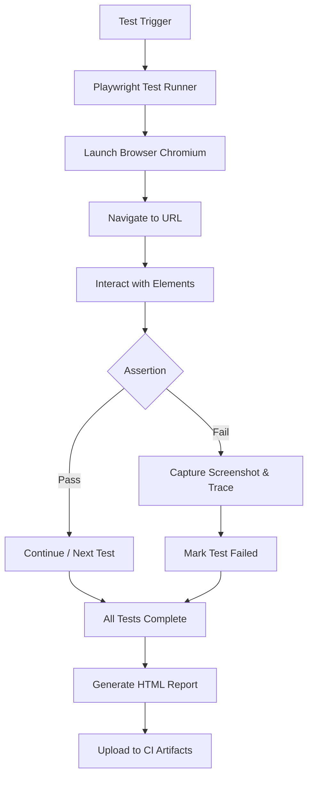

# Playwright Automation

A hands-on learning project exploring end-to-end test automation with [Playwright](https://playwright.dev/).

---

## Tech Stack

| Tool | Version |
|---|---|
| [Playwright](https://playwright.dev/) | ^1.61.0 |
| [@playwright/test](https://www.npmjs.com/package/@playwright/test) | ^1.61.0 |
| [@cucumber/cucumber](https://www.npmjs.com/package/@cucumber/cucumber) | ^13.0.0 |
| Language | JavaScript / TypeScript |
| Test Runner | Playwright Test |
| CI | GitHub Actions |
| Reporting | Playwright HTML Reporter, Allure Reporter |

---

## Folder Structure

```text
Playwright-Automation/
|-- .github/workflows/    # GitHub Actions CI pipeline
|   `-- playwright.yml
|-- tests/                # All test specs
|   |-- UIBasicstest.spec.js
|   |-- loginpagePractise.spec.js
|   |-- clientAppPO.spec.js
|   |-- POManagerClientApp.spec.js
|   |-- Rahul_clientAppPO.spec.js
|   |-- Rahul_clientAppPO.spec.ts
|   |-- TestdataClientApp.spec.js
|   |-- rahulsheetyAcademy.spec.js
|   |-- OtherRahulsheetyAcademy.spec.js
|   |-- llc.spec.js
|   |-- moreValidations.spec.js
|   |-- calender.spec.js
|   |-- webApiPart1.spec.js
|   |-- WebApiPart2.spec.js
|   |-- RefactorWebAPI.spec.js
|   |-- NetworkTest.spec.js
|   |-- NetworkTest2.spec.js
|   |-- upoad-download.spec.js
|-- pageobjects/          # Reusable UI page object classes
|   |-- LoginPage.js
|   |-- LoginPagePractisePage.js
|   |-- DashBoardPage.js
|   |-- CartPage.js
|   |-- OrdersReviewPage.js
|   |-- OrdersHistoryPage.js
|   `-- POManager.js
|-- Rahul_pageobjects/    # Alternate full POM implementation from course practice
|   |-- LoginPage.js
|   |-- DashboardPage.js
|   |-- CartPage.js
|   |-- OrdersReviewPage.js
|   |-- OrdersHistoryPage.js
|   `-- POManager.js
|-- Rahul_pageobjects_ts/ # Alternate TypeScript POM implementation
|   |-- LoginPage.ts
|   |-- DashboardPage.ts
|   |-- CartPage.ts
|   |-- OrdersReviewPage.ts
|   |-- OrdersHistoryPage.ts
|   `-- POManager.ts
|-- utils/                # Reusable utility/helper classes and test data
|   |-- APIUtils.js
|   |-- test-base.js
|   `-- placeOrderTestData.json
|-- utils_ts/             # TypeScript utility classes and test data
|   `-- test-base.ts
|-- playwright-report/    # Generated HTML reports (gitignored)
|-- allure-results/       # Generated Allure result files (gitignored)
|-- allure-report/        # Generated Allure HTML report (gitignored)
|-- test-results/         # Test artifacts / screenshots (gitignored)
|-- playwright.config.js  # Playwright configuration
|-- playwright.config1.js # Optional multi-project Playwright configuration
|-- package.json
`-- .gitignore
```

---

## Setup

```bash
# 1. Clone the repo
git clone https://github.com/nileshjanawade/Playwright_Automation_Udemy.git
cd Playwright_Automation_Udemy

# 2. Install dependencies
npm install

# 3. Install Playwright browsers
npx playwright install
```

---

## How to Run Tests

```bash
# Run all tests
npx playwright test

# Run all regression tests (alias for full suite)
npm run regression

# Run only @Web tagged tests
npm run webTests

# Run Safari tests with the multi-project config
npm run SafariNewConfig

# Run a specific test file
npx playwright test tests/UIBasicstest.spec.js

# Run the practice login flow
npx playwright test tests/loginpagePractise.spec.js

# Run the Page Object Model e-commerce flow
npx playwright test tests/clientAppPO.spec.js

# Run the POManager and data-driven e-commerce flows
npx playwright test tests/POManagerClientApp.spec.js
npx playwright test tests/Rahul_clientAppPO.spec.js
npx playwright test tests/Rahul_clientAppPO.spec.ts
npx playwright test tests/TestdataClientApp.spec.js

# Run API tests
npx playwright test tests/webApiPart1.spec.js
npx playwright test tests/RefactorWebAPI.spec.js

# Run tests in headed mode
npx playwright test --headed

# Run tests in a specific browser
npx playwright test --browser=firefox
npx playwright test --browser=webkit

# Run tests with UI mode
npx playwright test --ui

# Run tests with the optional multi-project config
npx playwright test tests/OtherRahulsheetyAcademy.spec.js --config playwright.config1.js

# Show the last HTML report
npx playwright show-report

# Run only @Web tagged tests
npx playwright test --grep "@Web" --reporter=line,allure-playwright

# Run only @nil tagged tests
npx playwright test --grep "@nil" --reporter=line,allure-playwright

# Generate and open an Allure report
allure generate ./allure-results --clean
allure open ./allure-report
```

## MCP metadata
This repository includes an `mcp.json` file at the repository root which provides metadata and convenient commands for automation consumers.

- Run all tests: `npx playwright test`
- Run `@nil` tests: `npx playwright test --grep "@nil"` or `npm run test:nil`

See [mcp.json](mcp.json) for the available `commands` and `files` globs.

> Note: The config currently defaults to Chromium with `headless: false`. Screenshots are captured with `screenshot: 'on'`, video is recorded with `video: 'retain-on-failure'`, traces are captured with `trace: 'on'`, and viewport is set to `720x720`.

### Run a local MCP server
You can run a small local MCP server that serves `mcp.json` and exposes the `commands` object at `/commands`:

```bash
# from the repository root
npm run start:mcp
# or: node mcp-server.js

# open http://localhost:3000/mcp.json or http://localhost:3000/commands
```

---

## Learning Progress

### Covered Concepts

| Concept | Files |
|---|---|
| **Locators** - CSS, XPath, Playwright getBy\* locators | `UIBasicstest.spec.js`, `llc.spec.js`, `OtherRahulsheetyAcademy.spec.js` |
| **Browser Context & Pages** - `browser.newContext()`, `context.newPage()` | `UIBasicstest.spec.js` |
| **Form Interactions** - `fill()` vs `type()`, dropdowns, radio buttons, checkboxes | `UIBasicstest.spec.js` |
| **Assertions** - visibility, text, attributes, checkbox state | `UIBasicstest.spec.js`, `moreValidations.spec.js`, `rahulsheetyAcademy.spec.js` |
| **Child Window Handling** - `context.waitForEvent('page')` | `UIBasicstest.spec.js` |
| **Dialog Handling** - `page.on('dialog', ...)` | `moreValidations.spec.js` |
| **Mouse Hover** - `page.locator().hover()` | `moreValidations.spec.js` |
| **iFrames** - `page.frameLocator()` | `moreValidations.spec.js` |
| **Calendar / Date Picker** - month, year, date navigation | `calender.spec.js` |
| **End-to-End E-Commerce Flow** - login, product selection, cart, checkout, order verification | `rahulsheetyAcademy.spec.js`, `OtherRahulsheetyAcademy.spec.js` |
| **UI Page Object Model (POM)** - reusable page classes for login, dashboard, cart, order review, and order history flows | `clientAppPO.spec.js`, `POManagerClientApp.spec.js`, `Rahul_clientAppPO.spec.js`, `pageobjects/`, `Rahul_pageobjects/` |
| **Practice Login Flow** - login to the shop page and verify the iPhone X product using a dedicated page object | `tests/loginpagePractise.spec.js`, `pageobjects/LoginPagePractisePage.js` |
| **POManager Pattern** - central page object factory for cleaner test setup | `POManagerClientApp.spec.js`, `pageobjects/POManager.js`, `Rahul_pageobjects/POManager.js` |
| **Fixtures & Data-Driven Tests** - custom fixture data and JSON-driven order scenarios | `TestdataClientApp.spec.js`, `utils/test-base.js`, `utils/placeOrderTestData.json` |
| **API Testing** - `request.newContext()`, `apiContext.post()`, token auth, order creation | `webApiPart1.spec.js` |
| **Hooks & Token Injection** - `test.beforeAll`, `page.addInitScript()` for localStorage auth bypass | `webApiPart1.spec.js` |
| **Storage State** - `browser.newContext()`, `context.storageState()` for auth state persistence | `WebApiPart2.spec.js` |
| **API Utility Refactor** - reusable utility classes for API workflows | `RefactorWebAPI.spec.js`, `utils/APIUtils.js` |
| **API Error Handling** - response status checks and descriptive error handling | `utils/APIUtils.js` |
| **Network Route Interception** - `page.route()` to intercept and modify API responses | `NetworkTest.spec.js`, `NetworkTest2.spec.js` |
| **Request Mocking** - `route.fulfill()` with fake response payloads | `NetworkTest.spec.js` |
| **Security Testing** - URL manipulation in intercepted routes to test authorization | `NetworkTest2.spec.js` |
| **Route Blocking** - `route.abort()` to block CSS, images, etc. | `rahulsheetyAcademy.spec.js`, `UIBasicstest.spec.js` |
| **Network Event Logging** - `page.on('request')` and `page.on('response')` to monitor traffic | `rahulsheetyAcademy.spec.js` |
| **Element Screenshots** - `locator.screenshot()` for partial captures | `moreValidations.spec.js` |
| **Full Page Screenshots** - `page.screenshot()` for full-page captures | `moreValidations.spec.js` |
| **Visual Regression Testing** - `toMatchSnapshot()` for pixel comparison | `moreValidations.spec.js` |
| **Screenshots & Traces** - automatic capture for debugging | `playwright.config.js` |
| **Allure Reporting** - Allure result generation with the Playwright reporter | `playwright.config.js`, `package.json` |
| **Multi-Project Configuration** - browser projects, retries, workers, permissions, and HTTPS handling | `playwright.config1.js` |
| **File Upload/Download with Excel** - `page.waitForEvent('download')`, `setInputFiles()`, Excel read/write with `exceljs` | `upoad-download.spec.js` |
| **CI Integration** - GitHub Actions workflow | `.github/workflows/playwright.yml` |

### Planned Next Steps

- Parallel execution and sharding
- Environment-based test credentials

---

## Troubleshooting

### No tests found

If Playwright shows `Error: No tests found`, check that:

- The file path in the command matches an existing spec file.
- The spec file contains at least one Playwright `test(...)` block.
- The file name matches Playwright's default patterns, such as `*.spec.js` or `*.test.js`.

Example:

```bash
npx playwright test tests/webApiPart1.spec.js
```

An empty file like `tests/calender.spec.js` will be discovered by name, but Playwright will still report no tests because there is no test case inside it.

---

## Automation Flow



---

## Reports & CI

---

**Repository Sync**: Merged remote updates and local changes on 2026-07-12; resolved a merge conflict in `commands` and updated Cucumber usage examples.

- HTML reports are generated automatically in `playwright-report/`.
- View the latest report with `npx playwright show-report`.
- Allure result files are generated in `allure-results/` when tests run.
- Generate the Allure HTML report with `npx allure-commandline generate ./allure-results --clean`.
- Open the Allure report with `npx allure-commandline open ./allure-report`.
- GitHub Actions runs tests on push and pull request.
- Screenshots and traces are available for debugging failed tests.

---

## Learning Notes

- This repo is intentionally simple, so it is easy to follow the Playwright APIs step by step.
- All tests target public demo sites, including Rahul Shetty Academy, Path2USA, and My Campus Forum.
- If you are new to Playwright, start with `UIBasicstest.spec.js`.
- Compare `rahulsheetyAcademy.spec.js` with `OtherRahulsheetyAcademy.spec.js` to see different locator strategies for the same flow.

---

## License

ISC
