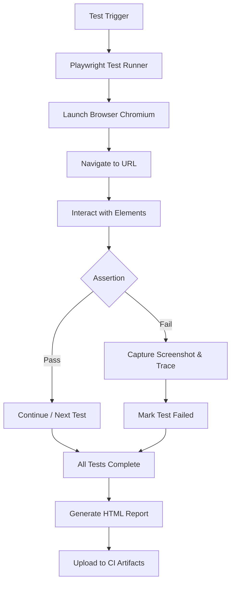

# Playwright Automation

A hands-on learning project exploring end-to-end test automation with [Playwright](https://playwright.dev/).

---

## Tech Stack

| Tool | Version |
|---|---|
| [Playwright](https://playwright.dev/) | ^1.61.0 |
| [@playwright/test](https://www.npmjs.com/package/@playwright/test) | ^1.61.0 |
| Language | JavaScript (CommonJS) |
| Test Runner | Playwright Test (built-in) |
| CI | GitHub Actions (push / PR on `main` / `master`) |
| Reporting | Playwright HTML Reporter |

---

## Folder Structure

```
Playwright-Automation/
├── .github/workflows/    # GitHub Actions CI pipeline
│   └── playwright.yml
├── tests/                # All test specs
│   ├── UIBasicstest.spec.js
│   ├── rahulsheetyAcademy.spec.js
│   ├── OtherRahulsheetyAcademy.spec.js
│   ├── llc.spec.js
│   ├── moreValidations.spec.js
│   ├── calender.spec.js
│   └── webApiPart1.spec.js
├── playwright-report/    # Generated HTML reports (gitignored)
├── test-results/         # Test artifacts / screenshots (gitignored)
├── playwright.config.js  # Playwright configuration
├── package.json
└── .gitignore
```

---

## Setup

```bash
# 1. Clone the repo
git clone https://github.com/nileshjanawade/Playwright_Automation_Udemy.git
cd Playwright-Automation

# 2. Install dependencies
npm install

# 3. Install Playwright browsers (Chromium, Firefox, WebKit)
npx playwright install
```

---

## How to Run Tests

```bash
# Run all tests (Chromium, headed mode - configured in playwright.config.js)
npx playwright test

# Run a specific test file
npx playwright test tests/UIBasicstest.spec.js

# Run tests in headed mode (config already sets headless: false)
npx playwright test --headed

# Run tests in a specific browser
npx playwright test --browser=firefox
npx playwright test --browser=webkit

# Run tests across multiple browsers
npx playwright test --browser=all

# Run tests with UI mode (interactive Test Runner)
npx playwright test --ui

# Show the last HTML report
npx playwright show-report
```

> **Note:** The config defaults to `headless: false` and `browserName: chromium`. Screenshots are captured on every step (`screenshot: 'on'`), and traces are kept on failure (`trace: 'retain-on-failure'`).

---

## Learning Progress

### Covered Concepts

| Concept | Files |
|---|---|
| **Locators** — CSS, XPath, Playwright getBy\* (role, label, placeholder, text) | `UIBasicstest.spec.js`, `llc.spec.js`, `OtherRahulsheetyAcademy.spec.js` |
| **Browser Context & Pages** — `browser.newContext()`, `context.newPage()` | `UIBasicstest.spec.js` |
| **Form Interactions** — `fill()` vs `type()`, dropdowns, radio buttons, checkboxes | `UIBasicstest.spec.js` |
| **Assertions** — `toContainText`, `toBeVisible`, `toBeHidden`, `toBeChecked`, `isChecked`, `toHaveAttribute`, `toHaveText` | `UIBasicstest.spec.js`, `moreValidations.spec.js`, `rahulsheetyAcademy.spec.js` |
| **Child Window Handling** — `context.waitForEvent('page')` | `UIBasicstest.spec.js` |
| **Dialog Handling** — `page.on('dialog', ...)` | `moreValidations.spec.js` |
| **Mouse Hover** — `page.locator().hover()` | `moreValidations.spec.js` |
| **iFrames** — `page.frameLocator()` | `moreValidations.spec.js` |
| **Calendar / Date Picker** — month, year, date navigation | `calender.spec.js` |
| **End-to-End E-Commerce Flow** — login, product selection, cart, checkout, order verification | `rahulsheetyAcademy.spec.js`, `OtherRahulsheetyAcademy.spec.js` |
| **API Testing** — `request.newContext()`, `apiContext.post()`, token-based auth, order creation via API | `webApiPart1.spec.js` |
| **Hooks & Token Injection** — `test.beforeAll`, `page.addInitScript()` for localStorage auth bypass | `webApiPart1.spec.js` |
| **Screenshots & Traces** — automatic capture on failure | `playwright.config.js` |
| **CI Integration** — GitHub Actions workflow | `.github/workflows/playwright.yml` |

### Planned Next Steps

- Page Object Model (POM) — abstract page interactions into reusable classes
- Fixtures — custom data-driven fixtures
- Visual regression testing
- Authentication state reuse
- Parallel execution & sharding

---

## Automation Flow



---

## Reports & CI

- **HTML reports** are generated automatically after every run in `playwright-report/`.
- View the latest report: `npx playwright show-report`.
- **GitHub Actions** runs all tests on every push / pull request to `main` / `master` and uploads the report as a CI artifact (retained for 30 days).
- **Screenshots** are captured at every step (`screenshot: 'on'` in config).
- **Traces** are recorded on test failure for debugging via Playwright Trace Viewer.

---

## Learning Notes

- This repo is intentionally kept simple — no abstractions or frameworks yet. It's a playground for understanding Playwright APIs step by step.
- All tests target public demo sites (Rahul Shetty Academy, Path2USA, My Campus Forum) — no API keys or secrets required.
- If you're new to Playwright, start with `UIBasicstest.spec.js` — it covers the most foundational concepts.
- Compare `rahulsheetyAcademy.spec.js` (CSS locators) with `OtherRahulsheetyAcademy.spec.js` (getBy\* locators) to see different locator strategies for the same flow.
- Feel free to fork, add your own tests, or refactor parts into a POM structure as a learning exercise.

---

## License

ISC
